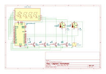

# 7-Segment-Thermometer
A simple project using 2 onewire thermal sensors an arduino nano and a 4 digit common cathode 7 segment display

<!-- TABLE OF CONTENTS -->
<details>
  <summary>Table of Contents</summary>
  <ol>
    <li>
      <a href="#about-the-project">About The Project</a>
    </li>
    <li>
      <a href="#getting-started">Getting Started</a>
      <ul>
        <li><a href="#Prerequisites">Prerequisites</a></li>
        <li><a href="#Installation">Installation</a></li>
        <li><a href="#Building the circuit">Building the circuit</a></li>
      </ul>
    </li>
    <li><a href="#roadmap">Roadmap</a></li>
    <li><a href="#contact">Contact</a></li>
        <li><a href="#license">License</a></li>
  </ol>
</details>

## About The Project
This is a simple project created using and Arduino Nano paired with 2 thermal sensors(DS18B20 or compatible) and a 7 segment display used to show the temperature both inside and outside of my room. 
<p align="right">(<a href="#readme-top">back to top</a>)</p>

<!-- GETTING STARTED -->
## Getting Started

Replicating the project

### Prerequisites

* Arduino IDE
    * install from the Arduino library manager
        * OneWire.h
        * DallasTemperature.h

### Installation

1. Clone the repo
```sh
git clone https://github.com/enragedcanadiangoose/7-Segment-Thermometer.git
```
2. Open the "./7-Segment-Thermometer/Thermometer/" folder in the Arduino IDE

### Building the circuit

  
<p>You can follow this diagram to replicate the circuit I used, this should let the code function with no modification</p>
  
<p>Here is the version that I built on a prototyping breadboard, it's a bit of a sloppy prototype but it works</p>
<p align="right">(<a href="#readme-top">back to top</a>)</p>

## Roadmap

<p>At some point a run of PCBs may be ordered</p>
<p align="right">(<a href="#readme-top">back to top</a>)</p>

## Contact
<p>email: astew2693@gmail.com</p>
<p align="right">(<a href="#readme-top">back to top</a>)</p>

## License

<p>see LICENSE.txt for details</p>